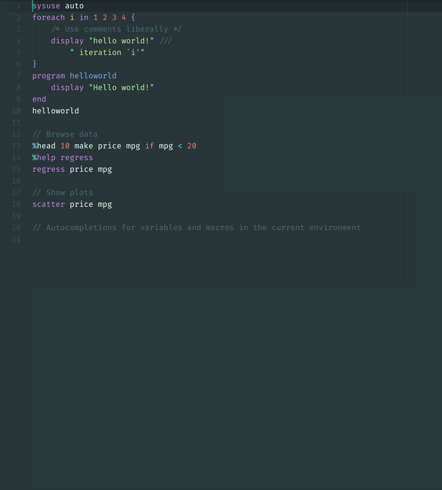

# stata_kernel

`stata_kernel` is a Jupyter kernel for Stata. It works on Windows, macOS, and
Linux.

## What is Jupyter?

Jupyter is an open-source ecosystem for interactive data science. Originally
developed around the Python programming language, Jupyter has grown to interface
with dozens of programming languages.

`stata_kernel` is the bridge that interactively connects Stata to all the
elements in the ecosystem.

- [**JupyterLab**](using_jupyter/lab.md) is a web-based interactive editor that allows for interweaving of code, text, and results.

    - Splice models in LaTeX math mode with the code that implements them and the graphs depicting their output.
    - [Click here](https://nbviewer.jupyter.org/github/kylebarron/stata_kernel/blob/master/examples/Example.ipynb) to see an example Jupyter Notebook file using `stata_kernel`.
    - Jupyter Notebooks can be exported as PDFs or HTML, and are as good for teaching new students as they are for displaying research results.

    

- [**Hydrogen**](using_jupyter/atom.md) is a package for the [Atom text editor](https://atom.io) that connects with Jupyter kernels to display results interactively in your text editor.
- The [**Jupyter console**](using_jupyter/console.md) is an enhanced interactive console. Its features include enhanced autocompletion, better searching of history, syntax highlighting, among others. The similar [QtConsole](using_jupyter/qtconsole.md) even allows displaying plots within the terminal.
- [Enhanced remote work](using_jupyter/remote.md). You can set up Jupyter to run computations remotely but to show results locally. Since the only data passing over the network are the text inputs and outputs from Stata, communcation happens much faster than loading `xstata`, especially on slower networks. Being able to use Jupyter Notebook or Hydrogen vastly enhances productivity compared to working with the Stata console through a remote terminal.

## `stata_kernel` Features

- [x] Supports Windows, macOS, and Linux.
- [x] Use any type of comments in your code, not just `*`.
- [x] [Autocompletions](using_stata_kernel/intro#autocompletion) as you type based on the variables, macros, scalars, and matrices currently in memory. As of version 1.6.0 it also suggests file paths for autocompletion.
- [x] [Display graphs](using_stata_kernel/intro/#displaying-graphs).
- [x] Receive results as they appear, not after the entire command finishes.
- [x] [Pull up interactive help files within the kernel](using_stata_kernel/magics#help).
- [x] [Browse data interactively](using_stata_kernel/magics#browse).
- [x] [`#delimit ;` interactive support](using_stata_kernel/intro#delimit-mode)
- [x] Work with a [remote session of Stata](using_jupyter/remote).
- [x] Mata interactive support
- [ ] Cross-session history file

## Screenshots

**Atom**

