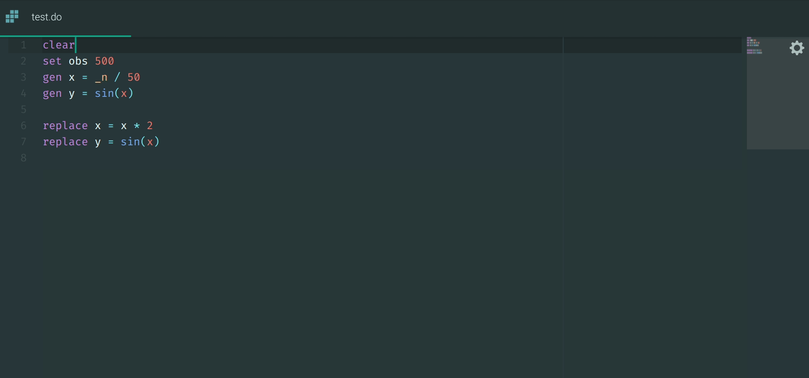

# Hydrogen in Atom

Hydrogen is a package for the Atom text editor that connects with Jupyter kernels, such as `stata_kernel`, to display results interactively inside the text editor.

I'll go over how to install Atom and Hydrogen, and then provide a quick overview of Hydrogen's capabilities. For more information on how to use Hydrogen, see [Hydrogen's documentation](https://nteract.gitbooks.io/hydrogen/docs/Usage/GettingStarted.html).

## Installation

Atom and Hydrogen are both free and open source software, just like `stata_kernel`. The download and install is free and easy.

### Atom

Go to [atom.io](https://atom.io), choose the installer for your operating system, then double click the downloaded file.

### Hydrogen

Next you'll need to install a couple add-on packages:

- [Hydrogen](https://atom.io/packages/hydrogen): this connects to Jupyter kernels and allows you to view results in-line next to your code. You can use it with Python, R, and Julia, as well as Stata.
- [language-stata](https://atom.io/packages/language-stata): this provides syntax highlighting for Stata code and is necessary so that Hydrogen knows that a file with extension `.do` is a Stata file.

To install these, go to the Atom Settings. You can get there by clicking Preferences > Settings in the menus or by using the keyboard shortcut <kbd>Ctrl</kbd>+<kbd>,</kbd> (<kbd>Cmd</kbd>-<kbd>,</kbd> on macOS). Then click _Install_ on the menu in the left, and type in `Hydrogen`, and `language-stata`, and click `Install`.

Once those are installed, open a do-file and run <kbd>Ctrl</kbd>-<kbd>Enter</kbd> (<kbd>Cmd</kbd>-<kbd>Enter</kbd> on macOS) to start the Stata kernel.

## Using Atom

If you've never used Atom before, you're in luck, because it's quite simple and intuitive to use.
[Read here](https://flight-manual.atom.io/getting-started/sections/atom-basics/) for some basics about how to use Atom.

The most important thing to know is that you can access every command available to you in Atom by using the keyboard shortcut <kbd>Ctrl</kbd>+<kbd>Shift</kbd>+<kbd>P</kbd> (<kbd>Cmd</kbd>+<kbd>Shift</kbd>+<kbd>P</kbd> on macOS). This brings up a menu, called the _Command Palette_, where you can find any command that any package provides.

## Running code

There are three main ways to run code using Hydrogen:

- Selection. Manually select/highlight the lines you want to send to Stata and then run `Hydrogen: Run`, which is usually bound to <kbd>Ctrl</kbd>-<kbd>Enter</kbd>.
- Cursor block. When `Hydrogen: Run` is called and no code is selected, Hydrogen runs the current line. If code following the present line is more indented than the current line, Hydrogen will run the entire indented block.
- Cell. A cell is a block of lines to be executed at once. They are defined using `%%` inside comments. See [here](https://nteract.gitbooks.io/hydrogen/docs/Usage/GettingStarted.html#hydrogen-run-cell) for more information.

### Output

Output will display directly beside or beneath the block of code that was
selected to be run. Code that does not produce any output will show a check mark
when completed.

### Watch Expressions

Hydrogen allows for [_watch expressions_](https://nteract.gitbooks.io/hydrogen/docs/Usage/GettingStarted.html#watch-expressions). These are expressions that are automatically re-run after every command sent to the kernel. This is convenient for viewing regression output, graphs, or the data set after changing a parameter.

Note that since the watch expression is run after _every_ command, it shouldn't be something that changes the state of the data. For example, `replace mpg = mpg * 2` would be unwise to set as a watch expression because that would change the column's data after every command.

Using watch expressions with a graph:


Using watch expressions to browse data:


## Indentation and for loops

Stata `foreach` loops and programs must be sent as a whole to the kernel. If you
send only part of a loop, you'll receive a reply that insufficient input was
provided.

The easiest way to make sure that this happens is to indent all code pertaining
to a block. This will ensure all lines of the block are sent to `stata_kernel`,
even if the ending `}` has the same indentation as the initial line.

If the cursor is anywhere on the first line in the segment below, and you run
<kbd>Ctrl</kbd>-<kbd>Enter</kbd> or <kbd>Shift</kbd>-<kbd>Enter</kbd> (which
moves your cursor to the next line), it will include the final `}`.

```stata
foreach i in 1 2 3 4 {
    display "`i'"
}
```
